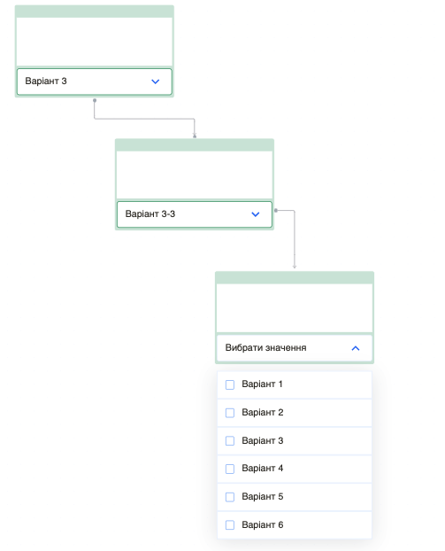

# Diagram flow
Diagram flow - its react application with nodes and edges.
## Feauture
- Clicking on the button reveals a dropdown list of variants.
- Selecting a variant triggers the appearance of the next node, connected to the previous one in a specific way. This action can be repeated multiple times.
- The button text updates to reflect the selected option.
- All values are persisted even when the page is reloaded.
- Values dynamically change if another option is selected. Clicking again on the selected option removes the next node.


<span>

</span>

### Project built using:
- [React+Vite](https://vitejs.dev/guide/)
- [Redux](https://redux.js.org/)
- [Redux Persist](https://redux-toolkit.js.org/rtk-query/usage/persistence-and-rehydration)
- [React Flow](https://reactflow.dev/)
- [Emotion Styled Components](https://emotion.sh/docs/styled)

## Getting Started
1. Clone this repository:

```bash
git clone https://github.com/Tinkkid/Diagram-flow.git
```

2. Install all dependencies:

```bash
npm install
```

3. Start project: write command

```bash
npm run dev
```

4. Open [http://localhost:5173](http://localhost:5173) with your browser to see the result.

## Live page
Deploy on Vercel. Open page - use link [Diagram Flow]()
